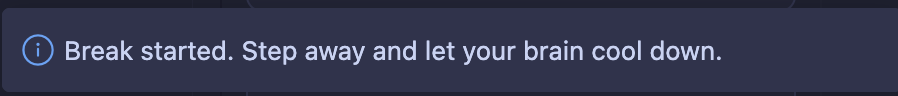
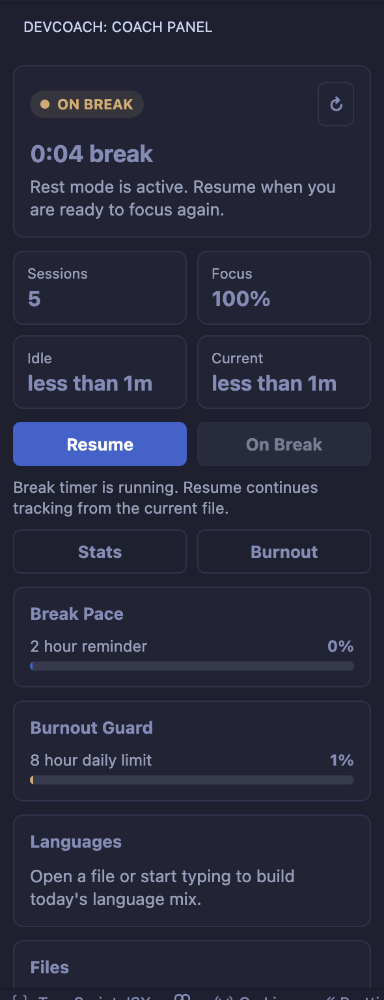
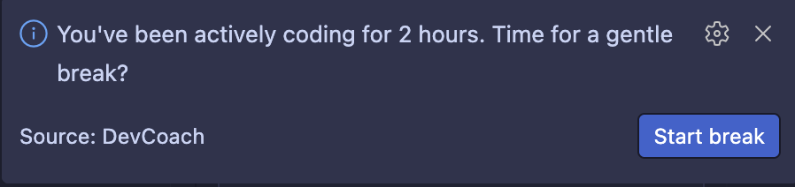
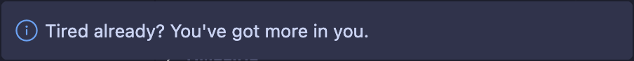
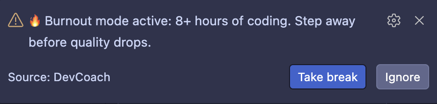
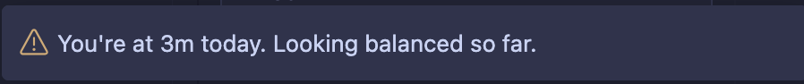
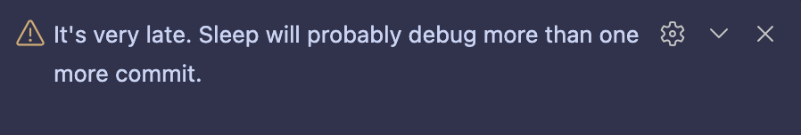

  

  
  

**DevCoach is a VS Code extension that acts as your personal coding coach. It tracks your coding activity, builds smart sessions, and helps you maintain healthier work habits through real-time feedback and reminders.**

---

## 🚀 What it does

DevCoach runs silently in the background while you code and turns your activity into useful insights:

- Tracks your coding sessions automatically
- Monitors time spent per programming language
- Sends smart break and focus reminders
- Detects inactivity and encourages you to stay engaged
- Prevents burnout with adaptive alerts
- Encourages healthier coding routines

---

## ⚙️ Features

### ⏱️ Smart Session Tracking
DevCoach automatically detects when you start and stop coding, building structured sessions based on real activity instead of fixed timers.

---

### ☕ Break Reminders
You’ll receive reminders every 2 hours of active coding to take breaks and reset focus.

---

### 💤 Idle Detection
If you stop coding, DevCoach detects inactivity and responds with motivational messages to help you get back on track.

---

### 📊 Language Analytics
DevCoach tracks which programming languages you use and shows daily usage breakdowns.

Example:
- TypeScript: 65%
- JavaScript: 25%
- JSON: 10%

---

### 🔥 Burnout Protection
DevCoach monitors your total daily coding time and warns you when you’re overworking:

- 4h → gentle reminder
- 6h → strong warning
- 8h → burnout prevention alert

---

### 🌙 Sleep Awareness
Late-night coding sessions are detected, and DevCoach reminds you when it’s time to rest.

---

## 🧠 Philosophy

> DevCoach is not about coding more — it’s about coding better.

It helps you build sustainable habits, not just productivity spikes.

---

## 🎯 Target Users

- Students learning programming
- Developers working long hours
- Freelancers managing their own time
- Anyone who tends to lose track of time while coding

---

## 🔮 Vision

DevCoach turns your editor into a smart companion that helps you:

- stay focused
- avoid burnout
- understand your habits
- improve long-term productivity

---

## 📄 License

This project is source-available for personal and educational use only.
This project is licensed under the PolyForm Noncommercial License 1.0.0.

See the full license here: [LICENSE](LICENSE.txt)
